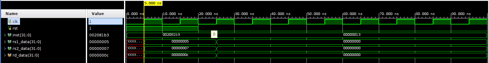
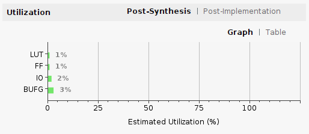

# RV32I SoC — Version 1.0

## ABOUT

This repository contains the design and implementation of a RV32I single-cycle RISC-V integer core written in Verilog HDL. The processor follows a finite state machine based execution flow without pipelining and currently does not include Control and Status Registers (CSR).

The objective of this project is to implement and verify a functional RV32I processor suitable for FPGA implementation and architectural study.

Version v1.0 represents the first stable RTL implementation with functional simulation.

---

## REPOSITORY STRUCTURE

```
RV32i-soc/
│
├── rtl/ -> Synthesizable RTL source files
├── sim/ -> Simulation testbench
├── images/ -> Simulation and report images
└── README.md
```


---

## RTL DIRECTORY

The `rtl` directory contains the synthesizable Verilog modules implementing the processor.

### Files inside rtl/

- `core.v`  
  Top-level processor module integrating datapath and control logic.

- `data_path.v`  
  Implements the datapath including operand selection, ALU connections, and data routing between stages.

- `control.v`  
  Control unit generating control signals based on decoded instruction fields.

- `alu.v`  
  Arithmetic Logic Unit responsible for arithmetic and logical operations.

- `reg_file.v`  
  Register file implementing the 32 general-purpose integer registers.

- `ifu.v`  
  Instruction Fetch Unit responsible for program counter update and instruction access.

- `instr_mem.v`  
  Instruction memory model used during simulation.

These modules together form the RV32I single-cycle processor implementation.

---

## SIMULATION DIRECTORY

The `sim` directory contains the simulation environment.

### Files inside sim/

- `sim.v`  
  Testbench used for functional verification of the processor.

The testbench initializes instruction memory and monitors:

- Register write operations
- Data memory access
- Instruction execution flow
- Final register and memory states

---

## SIMPLE TESTBENCH DESCRIPTION

The instruction memory is initialized using a HEX instruction file loaded through the `$readmemh` command. Each instruction corresponds to an RV32I assembly operation and expected result.

Example instruction sequence:

```
00c00093 // addi x1, x0, 12
00000193 // addi x3, x0, 0
000011b7 // lui x3, 0x1
0001a183 // lw x3, 0(x3)
fff1c193 // xori x3, x3, -1
00322223 // sw x3, 4(x4)
```

During simulation, all write accesses to base registers and data memory are monitored and printed in the console.

[BASEREG] indicates register write access.  
[MEMORY] indicates data memory write access.

After execution completes, the final state of registers and memory locations is displayed.

---

## SIMULATION WAVEFORM

The following waveform shows relevant register and memory activity during execution.



Signals observed:

- Instruction address (Program Counter)
- Register file updates
- Memory access transactions

---

## UTILIZATION (VIVADO SYNTHESIS REPORT)

The following image shows the resource utilization summary obtained from synthesis.



The report includes LUT usage, register count, and mux utilization for the implemented design.

---

## FEATURES (v1.0)

- RV32I base instruction support
- Single-cycle processor architecture
- FSM-based execution control
- Modular RTL design
- Functional simulation verification
- FPGA-ready RTL structure

---

## FUTURE WORK

- Pipeline implementation
- CSR support
- Additional testcases
- RV32 extensions
- SoC-level enhancements

---

## AUTHOR

Vignesh D  
FPGA / RTL Design
